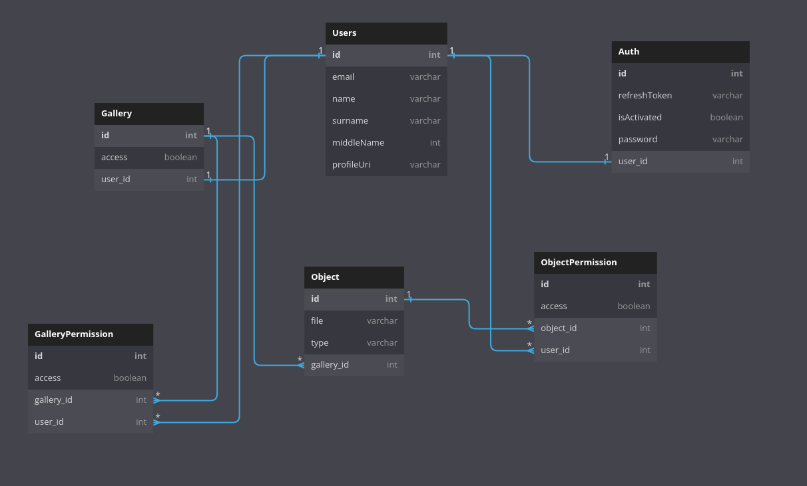

# GALLERY INTERNSHIP TASK
[NodeJS](http://nodejs.org) backend application: a gallery of images/videos of users with the ability
to distribute access permissions.

## How to run the app
Short instructions for installing modules and launching
the application:

1. Create .ENV file and declare environment variables, which are located in .env.example
```
APP_PORT=
APP_HOST=
APP_PROTOCOL=

ACCESS_TOKEN_SECRET_KEY=
ACCESS_TOKEN_EXPIRES_IN=

REFRESH_TOKEN_SECRET_KEY=
REFRESH_TOKEN_EXPIRES_IN=

EMAIL_TOKEN_SECRET_KEY=
EMAIL_TOKEN_EXPIRES_IN=

POSTGRES_USER=
POSTGRES_PASSWORD=
POSTGRES_PORT=
POSTGRES_HOST=
```
3. Run docker-compose:
```
$ sudo docker-compose up
```
3. Run the application (development mode)
```
yarn run start:dev
```
4. Open documentation after start server
```
https://127.0.0.1:3000/docs
```
## Database
Main entities:
* Users
* Auth
* Gallery
* Object (our files)
* ObjectPermission
* GalleryPermission

Current database schema:



## Application stack
Description of the technology stack used in the application:
* Programing language – [TypeScript](http://www.typescriptlang.org)
* Framework – [NestJS](https://nestjs.com/)
* Database – [PostgreSQL](https://www.postgresql.org/)
* ORM tool – [TypeORM](https://typeorm.io/)

